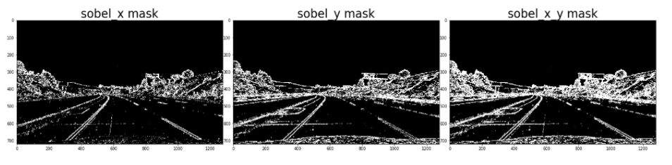
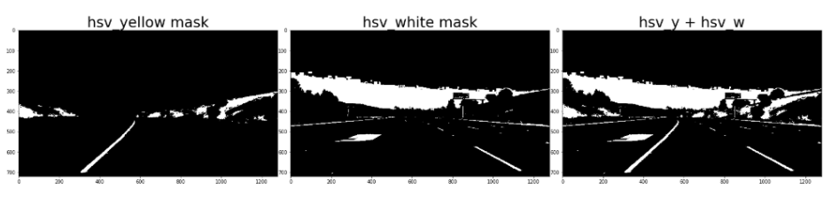
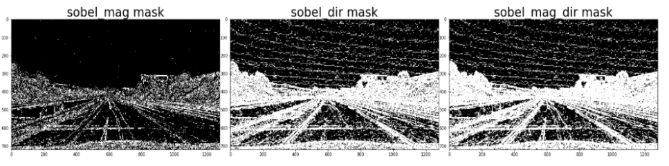
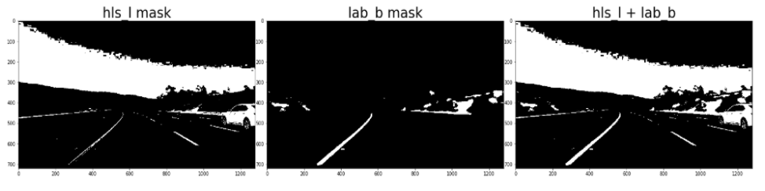
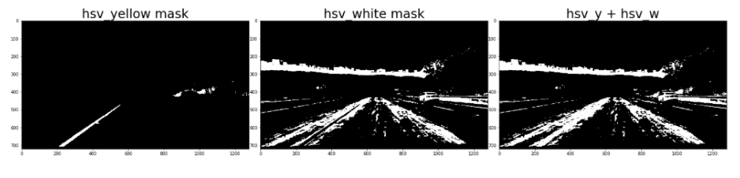
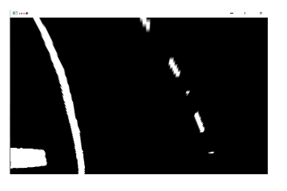
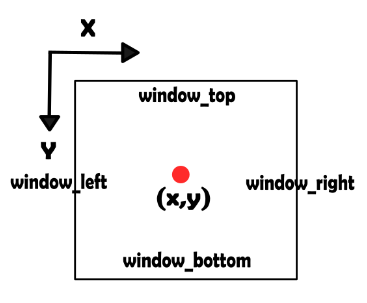
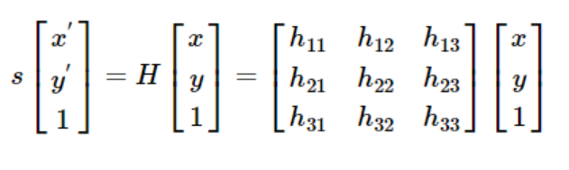
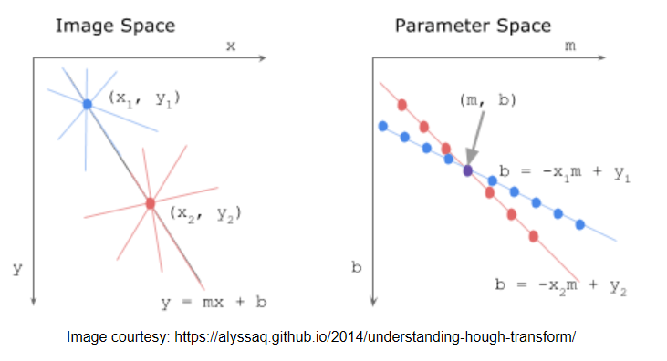

# Advanced-Lane-Line-Detection-Using-Python-and-OpenCV
This project is aimed to do simple 'Lane Line Detection' to mimic 'Lane Departure Warning Systems' used in Self Driving Cars

## Step 1: Input Preparation:
Before initiating the image processing, lens distortions of the camera were removed by using the camera matrix as well as the distortion parameters that are provided to us. For this purpose, inbuilt cv2 function undistort() is utilized.
For denoising of the image, initially, Gaussian blur filter was used. However, it was observed that it does not provide any significant improvements in the quality of the video frame. Also, it slowed down the video processing speed. Hence, it was decided to skip the gaussian blurring filter.
 Next, to create a thresholded binary mask, Canny edge detection, as well as various combinations of the color channels, were tried. Outputs obtained using these masks are given below:
* <b> Sobel-x and Sobel-y mask </b>
  

    
  

  First, the image frame was converted into a grayscale image and then binary thresholding was performed. Then Sobel x and Sobel y filter was applied to this thresholded image to extract the edges. Also, another mask was created by performing bitwise or operation on sobel_x and sobel_y.
* <b> hsv_yellow and hsv_white mask: </b>
  

    
  

  First, the image frame was converted into the HSV format so we can use color segmentation on it. Since it is known that the lane lines have either yellow or white colors, two masks were created using lower and upper threshold values of yellow and white respectively. Thus hsv_yellow mask was able to distinguish the yellow lane line and the hsv_white mask was able to distinguish the white lane line. Finally to get the complete lane detection both the masks were combined by performing a binary_or operation on them. The resulting mask ‘hsv_y + hsv_w’ is shown above.
* <b> sobel_mag and sobel_direction mask: </b>
  

    
  

  Sobel magnitude maks was created by computing the absolute magnitude of the sobel_x and sobel_y values. Similarly, Sobel direction mask was created by taking inverse tangent of the sobel_y/sobel_x values. Furthermore, both sobel_mag and sobel_dir were combined using bitwise_or operation.
* <b> lab_b and hls_l masks: </b>
  

    
  

  After separating the image into  various spaces, it was observed that the B channel in the LAB color space produces the brightest output for yellow color and L channel in the HLS color space produces the brightest output for white color. Hence the image frame was first converted into HLS and lab color spaces and from that l-channel and b-channel was extracted. To improve the quality of these color channels, histogram equalization was performed on them and appropriate thresholding values were selected. Finally, both hls_l and lab_b were combined by using binary or operation to get complete lane lines.
  
##  Observations:
1. Both hls_l + lab_b and hsv_yellow+hsv_white gave the brightest output for lane lines. However, HSV maks performed poorly under the shadow and high sunlight regions. Thus the idea of using HSV masks was discarded as using color-based segmentation is not reliable in case of lane detection. The following figure shows the performance of hsv_yellow+hsv_white mask during the shadow region of the video.
  

    
  

  It can be observed that the information about the white lane lines is completely lost during this time.
2. Both sobel_mag and sobel_dir masks and their combination mask gave noisy outputs even after trying multiple thresholding values. Thus, those masks were discarded.
3. Combination of the sobel_x and sobel_y gave good output, however, the thickness of the lines was not as good as we were expecting. Also, it was producing the wrong output in case of challenge video due to the presence of color difference on the road.
4. Furthermore we tried many other combinations of  the above-mentioned masks to get more robust results, however, those masks did not perform as good as we were expecting.
<b> Thus it was decided to move on with hls_l + lab_b mask to perform the lane lines edge detection as it performed better than other masks. </b>

## Step 2: Homographic transformation:
 After getting the desired binary image mask, it was warped using perspective transformation. To calculate the homography matrix, four points were selected on the lane. These points were warped into an image window of size 800X600 using cv2.getPerspectiveTransformation() and cv2.warpPerspective() functions. The resulting warped image was obtained as shown below:
  

    
  

## Step 3: Lane candidates selection:
 For lane candidate selection the Sliding Window algorithm is used. This algorithm works as follows:
1. Calculate histogram for the bottom half of the image. Since most of the white lane pixels are along the lane bottom, the peak of this histogram gives the location of the bottom of the right and left lanes.
2. Depending on the size of the warped image and size of the desired sliding window, calculate the maximum number of sliding windows that can be made.
3. Get all the non zero pixels on the binary warped image and separate their x and y coordinates.
4. Position the first window at the bottom points of the lane and using following logic find out the non zero pixels that lie inside the window:
 a. If pixel_x < window_right and pixel_x < window left and pixel_y < window_bottom and pixel_y > window_top then current pixel is within the window.
 

  
 

5. Once all the non zero pixels are found within the current window, check if the number of non zero pixels exceeds the predefined minimum threshold. This ensures that only regions with a high density of white pixels associated with the lanes are considered for polynomial fitting.
6. If the number is greater than the threshold, then find the mean location of all the non zero pixels.
7. Shift the window to this mean location and repeat the procedure from step 4.

## Step 4: Turning prediction:
 After we get left and right fitting coefficients for the left and right lane respectively, right and left curve equation is calculated using curve fitting. Using this equation, we can find x coordinate of any point on the lane, given its y coordinate and vice versa. Thus to predict the turn, first coordinates of the topmost points on the lane are calculated using 2nd-degree polynomial equation of the curve. The center of these points is calculated. Also, it is assumed that the camera center is at the image center in the horizontal direction. Thus if this center is on the left side of the center of the image below a certain threshold value (ie. center of lane - center of the image < thresh ), it is predicted that the road is turning left. Similarly, if it is on the right side of the center of the image above a certain threshold value (ie. center of lane - center of image > thresh ), it is predicted that the road is turning right. Otherwise, the road is considered to be straight.
 This is threshold is basically an error in estimation of the left and right lane curves.
 
## Step 5: Back projection on the original image:
 Since we have values of the fitting coefficients of both right and left lanes, we can trace the exact region of the lane on the warped image. Thus the following process is followed for drawing the detected lane region on the unwarped image: 
1. Find x and y coordinates of all the points on the lane using fitting coefficients.
2. Fill this region with green color.
3. Calculate the inverse of the homography matrix that was used for warping.
4. Using this inverse matrix, project this green region back on the original video.

## Homography:
 Homography is the mapping of one plane to another. It is the transformation between the two planes. In our case, we can use it to map the camera image to the world or the other way. The major applications for homography are Augmented Reality, Panorama Stitching, Image Correction/Restoration. Below is the Homography Matrix.
  

    
  

  
## Hough Transform:
 Hough transform is the technique used in image processing for detecting various geometric shapes such as lines, circles, etc. Hough transform can also be generalized for more complex shapes. More the number of coefficients in the equation of a geometric feature more is the complexity of the hough space.
    Hough transform divides a geometric shape into two spaces. One is Euclidean space (with x and y coordinates) and another is the hough space. For simplicity, let’s consider hough transform for the detection of line. In the Euclidean space, a line can be represented by the equation y = mx + b. Where m is the slope of the line and b is the y-intercept. Consider the following diagram.
  

    
  

  For any point x and y a line can be drawn in different directions using different m and b. If we plot these values of m and b in Hough space (parameter space), it can be observed that a point in the image space becomes a line in the parameter space. Since any two points lying on the same line in image space will have the same value of m and b, their corresponding lines in the parameter space would intersect at the value of m and b.     
    Using this logic, hough transform finds all the possible lines for each point in the image plane and plots those lines in the hough space. If many points lie on the same line in the image plane, it would cause many lines to intersect in the hough space. Thus Hough transform finds that pair of m and b which has the maximum number of intersections and uses those parameters to draw a line in the image space.
    
## How likely this pipeline will generalize to other similar videos:
The pipeline is likely to generalize the majority of the similar videos provided the lane lines are distinctive enough from the road background. However, the pipeline will fail in the following cases:
1. Poor video quality where lane lines are not visible.
2. Roads having sharp turns.
3. Light exposure is very much different than the given videos.
4. The roads without any lane lines.
6. If there are cars in the front blocking lane view.

## Acknowledgment:  historgram_polyfit() function implementation in this code is inspired  by the workflow mentioned in the ‘Udacity - Self Driving Nanodegree program.’ Explanation of each function and our intuition behind using it is written in the comments before every function.
